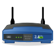

# UPnP Router Control



A GTK application to access the parameters of the router exposed via UPnP-IGD. Access to network speed, external IP and model name. It can manage port forwarding through a simple GUI interface.

<a href="https://flathub.org/apps/details/org.upnproutercontrol.UPnPRouterControl">

</a>

## Screenshot


## Installing from Flathub

You can install UPnP Router Control via [Flatpak](https://flathub.org/apps/details/org.upnproutercontrol.UPnPRouterControl).

    flatpak install flathub org.upnproutercontrol.UPnPRouterControl

## Installing from sources

In order to compile UPnP Router Control you need following software packages:
* GTK library ( >= 3.10 )
* GSSDP library ( >= 1.2 )
* GUPnP library ( >= 1.2 )

To build you need Meson (and thereby Ninja) build system:

```bash
meson build
ninja -C build
ninja -C build install
```

## Information

* Main project site:https://launchpad.net/upnp-router-control
* For bugs reports: https://bugs.launchpad.net/upnp-router-control
* Translations: https://translations.launchpad.net/upnp-router-control
* Donations: https://it.liberapay.com/DnaX/

